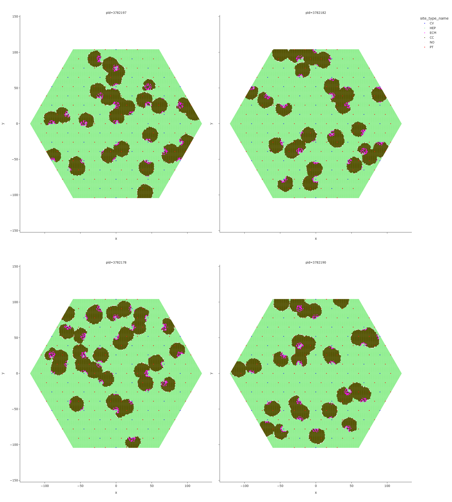
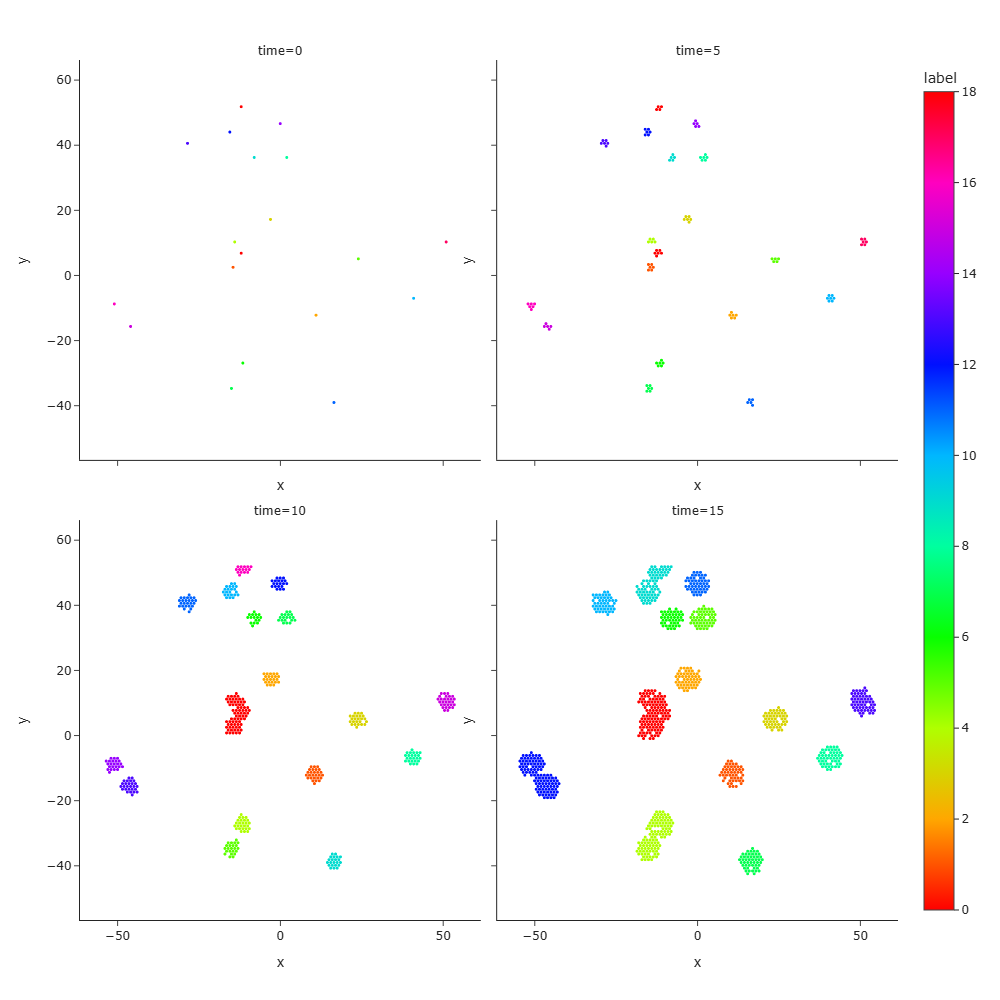
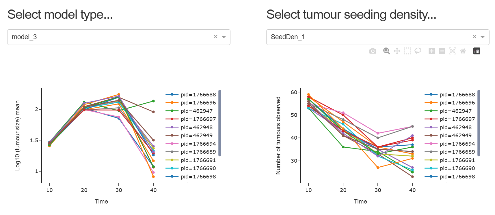

# About the repository 
This repository contains scripts used to generate and explore an Agent-Based Model (**ABM**) of tumour growth in a simple environment consisting of liver lobules. It has been developed for **Session 6: How to make computational models** of the [**Wellcome Connecting Science - Evolutionary Biology and Ecology of Cancer**](https://coursesandconferences.wellcomeconnectingscience.org/event/evolutionary-biology-and-ecology-of-cancer-20250630/).

# About the model
This developing ABM of tumour growth within liver lobules is part of an ongoing multi-disciplinary research project around investigating cellular and spatial mechanisms that regulate the outgrowth of colorectal cancer liver metastasis and scuplt its ecosystem, at the [**Integrative Modelling Lab, CRUK Scotland Institute**](https://www.crukscotlandinstitute.ac.uk/cruk-si-research/cruk-si-research-groups/xiao-fu.html#lab-members). 
Briefly, the evolution of the cellular system takes place on a hexagonal lattice, with updates of the state of lattice sites according to processes including cell growth, cell death, cell movement, lattice site clearance and fibrosis.

## model parameters ##

- `model_type`: the type of model to choose for a simulation. Current code implementation includes `model_1`, `model_2`, `model_3`, and `model_4`, described below.

- `cancer_cell_seeding_density`: the density of cancer cells to initialise in the lattice, with respect to the number of Central Veins (CVs). Default value is 1.

- `P_CC_GROW`: the probability of a cancer cell to grow. Default value is 1. In a simulation, for a cancer cell of interest, when there is at least 1 empty adjacent lattice site, a random number between 0 and 1 is generated and compared to `P_CC_GROW` to decide whether growth takes place. Growth happens in the form of creation of a new cancer cell on the empty site. In `model_4`, cell movement is implemented in the form of moving the current cell to the empty site and, for simplicity, happens whenever growth doesn't take place. 

- `P_HEP_DAMAGED`: the probability of a hepatocyte to be damaged by a cancer cell. Default value is 0.5. In a simulation, for a hepatocyte of interest, when there is a proliferative cancer cell on at least 1 adjacent lattice site, a random number between 0 and 1 is generated and compared to `P_HEP_DAMAGED` to decide whether the hepatocyte is damaged.

- `P_HEP_CLEARED`: the probability of a damaged hepatocyte gets cleared. Default value is 0.5. In a simulation, for a damaged hepatocyte of interest, a random number between 0 and 1 is generated and compared to `P_HEP_CLEARED` to decide whether the cell is cleared. Clearance happens in the form of deletion of the cancer cell from lattice and from the `cell_dictionaries`. In `model_2`, fibrosis is implemented in the form of creation of extracellular matrix to occupy an empty lattice site and, for simplicity, happens when a damaged hepatocyte is not cleared.

- `P_CC_KILLED`: the probability of a cancer cell gets killed, only in `model_3`. Default value is 0.5. In `model_3`, an implicit immune predation is implemented as randomly sampling K sites from the entire lattice, where K is equal to the number of sites occupied by cancer cells at the current time. Iterating over each of these K sites, if it is occupied by a cancer cell, a random number is generated and compared to `P_CC_KILLED` to decide whetehr the cancer cell is killed. The deaths of cancer cell happens in the form of emptying the lattice and removing the cancer cell from `cell_dictionaries`. 

## model types ##

The file **model_types_20250701.pdf** includes description of 4 model types currently implemented in the code. 
See example model snapshots below from replicate simulations. 

# About the codebase

## data structures ##
- `lattice_in_simulation` is a lattice-centred data structure and records information about the simulation lattice site, in the form of a Pandas DataFrame with columns [“site_id”, “x”, “y”, “site_type”, “cell_id”, “adjacent_site_ids_str”, “zonation_type”, ..].

- `cell_dictionaries` is a cell-centered data structure and records information about the Cell objects, in the form of a Dictionary of Dictionary. 

## classes and functions ## 
- `cell_classes.py` defines *CancerCell* and *Hepatocyte* classes with simple attributes. Future extension will introduce richer set of cell attributes and behaviours, e.g., related to clone identities for tracking evolution. 

- `settings.py` contains functions to set up configuration and parameters for a simulation.

- `initialisation_functions.py` includes functions to set up the `cell_dictionaries` and initialise the first *CancerCell* objects.   

- `simulation_functions.py` contains functions to update states of *Cell* objects and lattice sites according to biological processes modelled.

- `analysis_functions.py` contains a function to extract tumour sizes in a give simulation snapshot using the DBSCAN clustering algorithm.  

## notebooks ##

- `1_notebook_simulation.ipynb` contains codes to run a simulation and create snapshots, loading classes and functions described above. Input files `lattice_settings_2025-06-23.json` and `lattice_with_CVs_PTs_2025-06-23_annotated_without_tumour.csv` provided in `files` folder are required. A separate notebook `1_notebook_simulation_with_classes_and_functions.ipynb` that includes classes and functions is also provided, making it convenient to run the code on Google Colab.
See example model snapshots over time, coloured by DBSCAN cluster ids.

- `2_notebook_exploration.ipynb` contains codes to explore already generated data files from simulations, using Plotly Dash apps. Data files `selected_simulation_snapshots_at_40.csv` and `combined_results_tumour_sizes.csv` are required. A separate note book `2_notebook_exploration_with_classes_and_functions.ipynb` that includes classes and functions is also provided, making it convenient to run the code on Google Colab. 
See a screenshot of an Dash App below.

## files ##

- `lattice_settings_2025-06-23.json` contains information of the lattice (e.g., size of each lobule, size of the lattice) used for the simulation.

- `lattice_with_CVs_PTs_2025-06-23_annotated_without_tumour.csv` contains a prepared lattice with Portal Triads (PTs) and Central Veins (CVs) annotated. It requires calling function in `initialisation_functions.py` to further initialise tumour cells, or *CancerCell* objects.

- `selected_simulation_snapshots_at_40.csv` contains final snapshots of simulations already performed, in a larger lattice than the one mentioned above, using different types of models.

- `combined_results_tumour_sizes.csv` contains snapshots of replicate simulations (n=16) already performed, taken at multiple time points, using different types of models.

# Run the code

## On laptop

- Clone the repository: `git clone https://github.com/xiaofu-lab-beatson/ABM-Tutorial-Wellcome-EBEC.git`

- Set up the Conda environment:  `conda env create -f environment.yml -n myenv`; `conda activate myenv`

- Jupyter notebooks have been developed and tested using [Visual Studio Code](https://code.visualstudio.com/) on Windows 11 OS. 

## On Google Colab

<mark>Note that a Google account is required and that resources offered free of charge may not always be available.</mark>

- Go to [Google Colab](https://colab.research.google.com/). 

- Upload the `1_notebook_simulation_with_classes_and_functions.ipynb` and `2_notebook_exploration_with_classes_and_functions.ipynb` downloaded from the GitHub repository.

- Download the required data files from `files` folder. They will be uploaded when running the `uploaded = files.upload()` in the Jupyter notebooks.

# Exploration using the existing model and code

- Varying seeding density (`cancer_cell_seeding_density`) in all `model_type`

- Varying the propensity for fibrosis (`P_HEP_CLEARED`) in `model_2`

- Varying the efficiency of immune predation (`P_CC_KILLED`) in `model_3`

- Tradeoff between proliferation and migration (`P_CC_GROW`) in `model_4` 

# Extension beyond the existing model and code 

- Immune microenvironment: detailed modelling of pro-inflammatory and anti-inflammatory components and processes, and their spatio-temporal evolution

- Phenotypic heterogeneity and plasticity: detailed modelling of cancer cell attributes and behaviours, and the co-evolution with the liver environment

# Get in touch!
Please get in touch if you are interested in collaborating and/or using the model/code in your research. 

The code has been developed without using Generative AI. Despite careful proofreading and testing, there might be coding errors and typos. If you catch any errors and/or want to suggest improvements on implementation, please feel free to get in touch as well.  

The README is last updated on 2025 June 28.

[**Integrative Modelling Lab, CRUK Scotland Institute**](https://www.crukscotlandinstitute.ac.uk/cruk-si-research/cruk-si-research-groups/xiao-fu.html#lab-members)